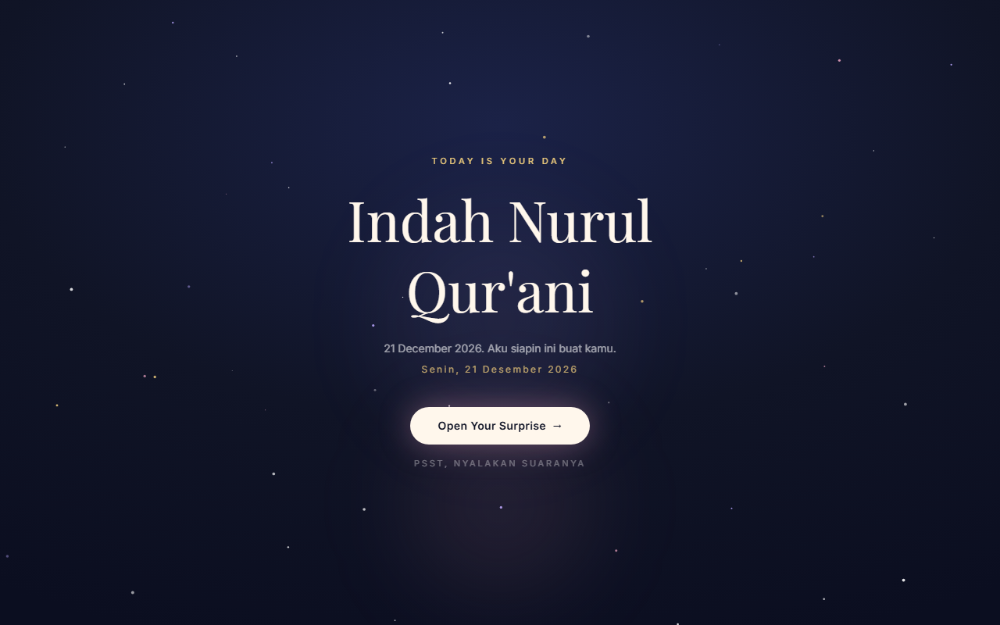
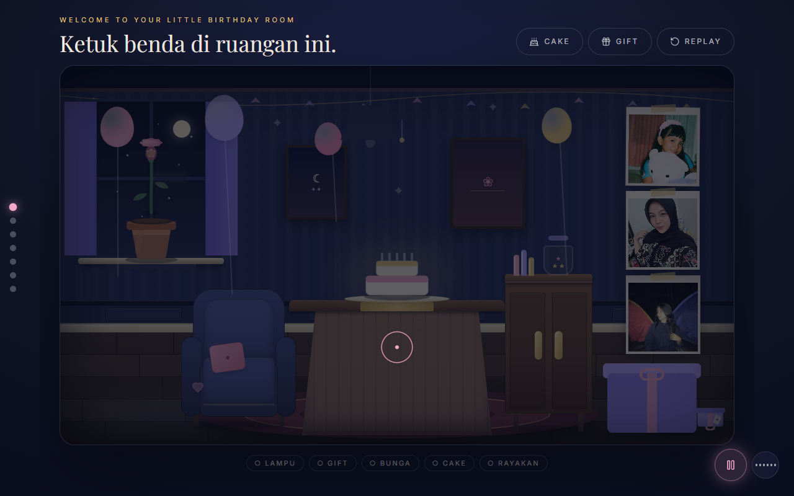

# Indah Birthday - Hadiah Digital Interaktif

Sebuah website kejutan ulang tahun yang imersif untuk Indah Nurul Qur'ani.
Alurnya sinematik: pembuka → amplop digital → kamar ulang tahun interaktif
yang bisa dijelajahi (lampu, hadiah, bunga, balon, foto, kue, lilin, harapan,
surat, kenangan) sampai selebrasi akhir dengan confetti dan kembang api.




## Fitur

- **Opening adaptif tanggal** - sebelum hari H tampil countdown + teaser harian,
  pas hari H / sesudahnya tampil sapaan ulang tahun.
- **Amplop digital animasi** - segel, flap 3D, surat naik, tombol masuk.
- **Birthday room interaktif** - kamera fokus per objek, parallax, progress dots:
  - Lampu gantung (toggle + hint alur)
  - Kotak hadiah (shake → buka → kartu pesan)
  - Bunga di kusen jendela (mekar bertahap → pesan rahasia)
  - Balon (meletus, ada yang berisi pesan / bintang)
  - Dinding foto + lightbox
  - Bintang rahasia (easter egg, 3 bintang → kejutan)
  - Hati tersembunyi
- **Kue & lilin** - lilin menyala satu per satu, bisa ditiup satu-satu atau via
  deteksi tiupan mikrofon, lalu momen wish.
- **Toples harapan** - kartu harapan bisa dibalik satu per satu.
- **Surat pribadi** - efek typewriter + skip.
- **Galeri kenangan & final** - grid foto, layar akhir + tombol replay dan
  tombol balas via WhatsApp.
- **Musik** - audio provider + music player + visualizer, SFX per interaksi.
- **Aksesibilitas** - label ARIA, fokus keyboard, skip-link, hormat ke
  `prefers-reduced-motion`.

## Tech Stack

- React 18 + Vite 6
- Framer Motion (animasi), Lucide React (ikon), Tailwind CSS 4
- Web Audio API (musik + SFX), MediaDevices (deteksi tiupan, opsional)

## Mulai

```bash
npm install
npm run dev      # http://localhost:5173
npm run build    # output ke dist/
npm run preview  # pratinjau hasil build
```

Mode tanggal untuk QA (hanya saat `npm run dev`):

- `http://localhost:5173/?as=before` - countdown sebelum hari H
- `http://localhost:5173/?as=birthday` - tampilan pas hari H
- `http://localhost:5173/?as=after` - tampilan sesudah hari H

## Kustomisasi

Semua konten personal terpusat di satu file:

- `src/data/birthdayData.js` - nama, tanggal (`birthday: '2026-12-21'`),
  pesan, memori, wishes, rahasia bintang, link WhatsApp, teaser harian,
  config musik (`/audio/birthday.mp3`).

Ganti foto di `public/images/`, musik di `public/audio/birthday.mp3`.

## Screenshots

Semua ada di folder [`screenshots/`](screenshots/):

| File | Halaman |
| ---- | ------- |
| `00-countdown.png` | Opening countdown (sebelum hari H) |
| `01-opening.png` | Opening ulang tahun |
| `02-envelope.png` | Amplop digital tertutup |
| `03-envelope-open.png` | Amplop terbuka + surat |
| `04-room.png` | Birthday room |
| `05-room-wishes.png` | Toples harapan |
| `06-room-gift.png` | Hadiah terbuka |
| `07-cake.png` | Kue + lilin |
| `08-celebration.png` | Pesan selebrasi |
| `09-letter.png` | Surat pribadi |
| `10-memories.png` | Galeri kenangan |
| `11-final.png` | Layar akhir |

Diambil otomatis dalam mode `?as=birthday` (desktop 1280×800). Lihat
`screenshots/README.md` untuk cara regenerate.

## Struktur

```
src/
  App.jsx                 # orkestrasi phase: loading → gate → envelope → room
  components/
    Opening.jsx           # gate + countdown + teaser
    Envelope.jsx          # amplop digital
    Room/BirthdayRoom.jsx # ruangan + semua overlay (cake/wishes/message/letter/memories/final)
    Room/Interactive*.jsx # lampu, hadiah, bunga, balon, hati, jendela, foto
    Cake/                 # kue, lilin, deteksi tiupan
    Celebration/          # confetti, fireworks
    Letter/               # surat pribadi
    Music/                # audio provider, player, visualizer
  data/birthdayData.js    # single source of truth konten
  hooks/                  # mode tanggal, state room, bunga, audio, countdown
```

## Lisensi

MIT - lihat [LICENSE](LICENSE).
